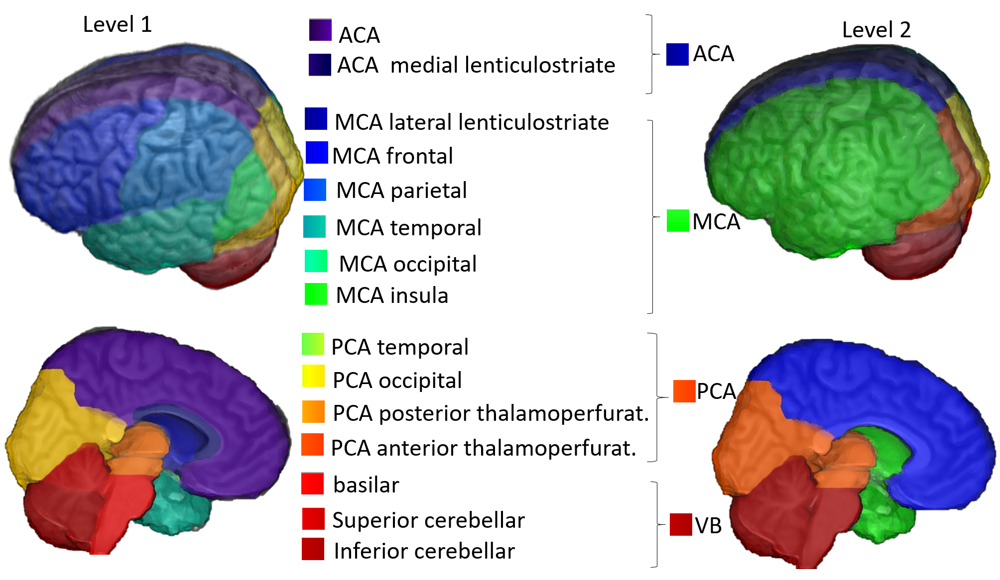

# Arterial Atlas:

## Introduction

We present an atlas of brain arterial territories based on the distribution of acute and subacute ischemic strokes in the diffusion weighted MRIs of 1,298 patients. The atlas  covers supra- and infra-tentorial regions and contains hierarchical segmentation levels created by a fusion of vascular and classical anatomical criteria. This deformable 3D digital atlas allows automatic and reproducible exploration of large-scaled data.


<p align="middle">
    
</p>


### Root
The `${ROOT}` is described as below.
```
${ROOT}
|-- data
    |-- Atlas
    |-- Atlas_182

* `data` contains two atlases in nii format and the corresponding label table in txt.

* Images under Atlas folder are compatible with JHU_MNI_SS (181x217x181)
* Images under Atlas_182 folder are compatible with JHU_MNI_SS (182x218x182)

* Image descriptions:

ArterialAtlas.nii: Image defining 30 arterial territories and ventricles. The intensities of the parcels correspond to their labels IDs, listed in the lookup table “ArterialAtlasLabels.txt 

ArterialAtlas_level2.nii: The combination of ArterialAtlas.nii parcels in 4 major territories (ACA, MCA, PCA, VB). The intensities of the parcels correspond to their labels, listed in the ArterialAtlasLabels.txt     

ArterialAtlasLabels.txt: is the “lookup table”. It contains the labels (descriptive and acronyms) for the regions defined in ArterialAtlas.nii and ArterialAtlas_level2.nii.     

ProbArterialAtlas_average.nii: 4D image of the arterial territory maps, calculated by averaging of lesion masks. Each dimension represents the probability of a voxel to belong to a certain vascular territory (ACA, MCA, PCA, VB, respectively).    

ProbArterialAtlas_BMM.nii: 4D image of the arterial territory maps, calculated by the BMM method. Each dimension represents the probability of a voxel to belong to a certain vascular territory (ACA, MCA, PCA, VB, respectively). 

BorderZone_ProbAve.nii: 4D image showing the ratio of average probability maps; first dimension is MCA / ACA, second dimension is MCA / PCA.    

TerritoryVoxels_BMM.nii: 3D image showing the assignment of voxels to major vascular territories, calculated through the variation in BMM µmax. The image intensities are: 1. ACA, 2. MCA, 3. PCA, 4. voxels attributed to more than one vascular territory, 5. voxels not attributed to any vascular territory. 

## Reference  

## Note
Our Atlas is based on JHU_MNI_SS (181x217x181). For compatibility with the MNI152 template from FSL (182x218x182), one can either “zero pad” the Atlas to the last dimension or “crop” the last dimension of MNI152-FSL. The JHU_MNI_SS (original and “MNI152-FSL compatible”) is downloadable from https://github.com/muschellij2/Eve_Atlas

## License 
Shield: [![CC BY-SA 4.0][cc-by-sa-shield]][cc-by-sa]

This work is licensed under a
[Creative Commons Attribution-ShareAlike 4.0 International License][cc-by-sa].

[![CC BY-SA 4.0][cc-by-sa-image]][cc-by-sa]

[cc-by-sa]: http://creativecommons.org/licenses/by-sa/4.0/
[cc-by-sa-image]: https://licensebuttons.net/l/by-sa/4.0/88x31.png
[cc-by-sa-shield]: https://img.shields.io/badge/License-CC%20BY--SA%204.0-lightgrey.svg
